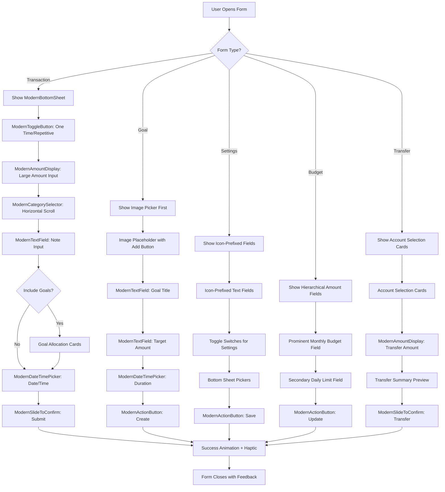

# Comprehensive Form UI Design System Specification

## Executive Summary

This specification combines insights from three transformation guides to create a unified, cohesive design system for modern Flutter form components. The system transforms traditional verbose forms into compact, visually appealing interfaces that prioritize user experience through intelligent design patterns, consistent spacing, and reusable components.

## 1. Core Design Principles

### 1.1 Visual Hierarchy
- **Large, prominent amount displays**: Center-aligned with gray pill background
- **Icon-driven category selection**: Colorful rounded square icons with labels
- **Minimal text input decoration**: Clean borders with ample padding
- **Bottom-anchored CTAs**: Dark rounded buttons with clear actions
- **Sheet-style overlays**: Rounded top corners with drag handle indicators

### 1.2 Spacing System
```dart
const double spacing_xs = 4.0;  // Tiny gaps
const double spacing_sm = 8.0;  // Small elements
const double spacing_md = 16.0; // Component spacing
const double spacing_lg = 24.0; // Section spacing
const double spacing_xl = 32.0; // Major sections
```

### 1.3 Color Palette
```dart
// Primary colors
const Color primaryBlack = Color(0xFF1A1A1A);
const Color primaryGray = Color(0xFFF5F5F5);
const Color accentGreen = Color(0xFF00D09C);
const Color textPrimary = Color(0xFF1A1A1A);
const Color textSecondary = Color(0xFF8E8E93);
const Color borderColor = Color(0xFFE5E5EA);

// Category colors (vibrant, distinct)
const Color categoryGreen = Color(0xFF00D09C);
const Color categoryBlack = Color(0xFF1A1A1A);
const Color categoryOrange = Color(0xFFFF6B2C);
const Color categoryBlue = Color(0xFF007AFF);
const Color categoryPink = Color(0xFFFF2D92);
const Color categoryPurple = Color(0xFF5E5CE6);
```

### 1.4 Typography System
```dart
const TextStyle displayLarge = TextStyle(
  fontSize: 48,
  fontWeight: FontWeight.w600,
  letterSpacing: -1.0,
);

const TextStyle titleLarge = TextStyle(
  fontSize: 28,
  fontWeight: FontWeight.w700,
  letterSpacing: -0.5,
);

const TextStyle bodyLarge = TextStyle(
  fontSize: 17,
  fontWeight: FontWeight.w400,
  letterSpacing: -0.4,
);

const TextStyle labelMedium = TextStyle(
  fontSize: 13,
  fontWeight: FontWeight.w500,
  letterSpacing: -0.2,
);
```

### 1.5 Border Radius System
```dart
const double radius_sm = 8.0;
const double radius_md = 12.0;
const double radius_lg = 16.0;
const double radius_xl = 24.0;
const double radius_pill = 999.0;
```

## 2. Reusable Component Library

### 2.1 ModernAmountDisplay Widget
**Purpose**: Large, prominent amount display with gray pill background

**Design Specs**:
- Center-aligned
- Large font size (48-56pt)
- Gray background (#F5F5F5)
- Pill-shaped (999px border radius)
- Generous padding (24px vertical, 48px horizontal)
- Dollar sign prefix
- Editable state with tap-to-edit functionality
- Smooth animation on value changes (scale + fade)

**Implementation Details**:
```dart
class ModernAmountDisplay extends StatefulWidget {
  final double amount;
  final bool isEditable;
  final ValueChanged<double>? onAmountChanged;
  final VoidCallback? onTap;

  const ModernAmountDisplay({
    Key? key,
    required this.amount,
    this.isEditable = false,
    this.onAmountChanged,
    this.onTap,
  }) : super(key: key);

  @override
  State<ModernAmountDisplay> createState() => _ModernAmountDisplayState();
}

class _ModernAmountDisplayState extends State<ModernAmountDisplay>
    with SingleTickerProviderStateMixin {
  late AnimationController _animationController;
  late Animation<double> _scaleAnimation;
  late Animation<double> _fadeAnimation;

  @override
  void initState() {
    super.initState();
    _animationController = AnimationController(
      duration: const Duration(milliseconds: 200),
      vsync: this,
    );

    _scaleAnimation = Tween<double>(begin: 0.8, end: 1.0).animate(
      CurvedAnimation(parent: _animationController, curve: Curves.easeOut),
    );

    _fadeAnimation = Tween<double>(begin: 0.7, end: 1.0).animate(
      CurvedAnimation(parent: _animationController, curve: Curves.easeOut),
    );

    _animationController.forward();
  }

  @override
  void didUpdateWidget(ModernAmountDisplay oldWidget) {
    super.didUpdateWidget(oldWidget);
    if (oldWidget.amount != widget.amount) {
      _animationController.reset();
      _animationController.forward();
    }
  }

  @override
  Widget build(BuildContext context) {
    return GestureDetector(
      onTap: widget.isEditable ? widget.onTap : null,
      child: AnimatedBuilder(
        animation: _animationController,
        builder: (context, child) {
          return Transform.scale(
            scale: _scaleAnimation.value,
            child: Opacity(
              opacity: _fadeAnimation.value,
              child: Container(
                padding: const EdgeInsets.symmetric(horizontal: 48, vertical: 24),
                decoration: BoxDecoration(
                  color: const Color(0xFFF5F5F5),
                  borderRadius: BorderRadius.circular(999),
                ),
                child: Text(
                  '\$${widget.amount.toStringAsFixed(0)}',
                  style: const TextStyle(
                    fontSize: 48,
                    fontWeight: FontWeight.w600,
                    color: Color(0xFF1A1A1A),
                    letterSpacing: -1.0,
                  ),
                ),
              ),
            ),
          );
        },
      ),
    );
  }

  @override
  void dispose() {
    _animationController.dispose();
    super.dispose();
  }
}
```

### 2.2 ModernCategorySelector Widget
**Purpose**: Horizontal scrollable category icons with labels

**Design Specs**:
- Rounded square icons (56x56px)
- Icon size: 24x24px
- Corner radius: 16px
- Vibrant, distinct colors per category
- Label below icon (13pt, medium weight)
- Horizontal scroll
- 12px spacing between items

### 2.3 ModernTextField Widget
**Purpose**: Clean, minimal text input with icon prefix

**Design Specs**:
- Height: 56px
- Border: 1px solid #E5E5EA
- Border radius: 12px
- Padding: 16px horizontal
- Icon prefix (optional): 24x24px, gray
- Placeholder: #8E8E93
- Text: #1A1A1A, 17pt

### 2.4 ModernDateTimePicker Widget
**Purpose**: Date and time selection with icon indicators

**Design Specs**:
- Two side-by-side buttons
- Light gray background (#F5F5F5)
- Rounded corners (12px)
- Icon + text layout
- Height: 56px

### 2.5 ModernToggleButton Widget
**Purpose**: Segmented control for binary choices

**Design Specs**:
- Light gray background (#F5F5F5)
- White selected state
- Rounded pill shape
- Smooth animation
- Equal width segments

### 2.6 ModernActionButton Widget
**Purpose**: Primary and secondary action buttons

**Design Specs**:
- Height: 56px
- Border radius: 16px
- Primary: Black background, white text
- Secondary: Light gray background, black text
- Full width by default
- Loading state support

### 2.7 ModernSlideToConfirm Widget
**Purpose**: Slide-to-confirm interaction for important actions

**Design Specs**:
- Light gray background
- Dark circle with chevron icon
- Animated sliding
- Haptic feedback
- "Slide to Save" text

### 2.8 ModernGoalAllocationCard Widget
**Purpose**: Goal allocation display with progress indicator

**Design Specs**:
- White background with border
- Rounded corners (12px)
- Icon + text + progress layout
- Compact height (~80px)

### 2.9 ModernBottomSheet Container
**Purpose**: Consistent bottom sheet wrapper with drag handle

**Design Specs**:
- Rounded top corners (24px)
- Drag handle indicator (4px height, 36px width)
- White background
- Padding: 24px horizontal, 16px top
- Shadow: subtle upward shadow

### 2.10 ModernKeyboard Widget
**Purpose**: Custom numeric keyboard overlay

**Design Specs**:
- 4x3 grid layout
- Light gray button background (#F5F5F5)
- Rounded buttons (12px)
- Large, clear numbers (24pt)
- Decimal and backspace buttons

## 3. Form-Specific Transformation Patterns

### 3.1 Transaction Forms (Add Income/Expense)

**Before**: Traditional form with stacked fields
**After**: Modern slide-up sheet with amount-first design

**Layout Structure**:
```
┌─────────────────────────────┐
│ [Drag Handle]               │
│                             │
│ One Time    [Repetitive]    │  ← ModernToggleButton
│                             │
│    [$2,400]                 │  ← ModernAmountDisplay
│                             │
│ [🏢] [💼] [🏠] [%] [💻]    │  ← ModernCategorySelector
│                             │
│ [✏️ Note]                   │  ← ModernTextField
│                             │
│ Include in Goals      [🔘]  │
│                             │
│ [📅 Today]  [🕐 12:36 PM]  │  ← ModernDateTimePicker
│                             │
│ [>> Slide to Save]          │  ← ModernSlideToConfirm
│                             │
│ [1] [2] [3]                 │
│ [4] [5] [6]                 │  ← ModernKeyboard
│ [7] [8] [9]                 │
│ [.] [0] [←]                 │
└─────────────────────────────┘
```

### 3.2 Goal Forms (Create/Edit Goal)

**Before**: Traditional vertical form
**After**: Image-first design with minimal fields

**Layout Structure**:
```
┌─────────────────────────────┐
│ Create Goal                 │
│                             │
│   [📷 Add Image]            │  ← Image placeholder
│                             │
│ [🎯 Goal Title]             │  ← ModernTextField
│                             │
│ [$ Target Amount]           │  ← ModernTextField
│                             │
│ [📅 Today] [📅 Until Forever] │ ← ModernDateTimePicker
│                             │
│ [Create]                    │  ← ModernActionButton
│                             │
│ [Keyboard...]               │
└─────────────────────────────┘
```

### 3.3 Profile/Settings Forms

**Before**: Standard form fields
**After**: Clean, icon-prefixed inputs

**Key Changes**:
- Use ModernTextField with appropriate icons
- Add ModernActionButton for primary action
- Use subtle borders and spacing
- Include ModernKeyboard for phone number

### 3.4 Budget Management Forms

**Before**: Multiple input fields
**After**: Focused, hierarchical input

**Key Changes**:
- Large, prominent amount displays
- Secondary fields in lighter style
- Clear visual hierarchy

**Layout Structure**:
```
┌─────────────────────────────┐
│ Manage Budget               │
│                             │
│ Total Monthly Budget        │
│ [$ 12,000]                  │  ← ModernTextField (prominent)
│                             │
│ Daily Budget Limit          │
│ [$ 200]                     │  ← ModernTextField (secondary)
│                             │
│ [Update]                    │  ← ModernActionButton
│                             │
│ [Keyboard...]               │
└─────────────────────────────┘
```

### 3.7 Transfer Forms

**Before**: Traditional account selection
**After**: Card-based account selectors with transfer summary

**Key Changes**:
- Account cards with balance display
- Transfer summary preview
- Amount input with validation
- Confirmation with slide-to-transfer

**Layout Structure**:
```
┌─────────────────────────────┐
│ Transfer Money              │
│                             │
│ From: [Account Card]        │
│ ↓                           │
│ To: [Account Card]          │
│                             │
│ [$ Amount]                  │  ← ModernAmountDisplay
│                             │
│ Transfer Summary:           │
│ From: Account A             │
│ To: Account B               │
│ Amount: $500.00             │
│                             │
│ [>> Slide to Transfer]      │  ← ModernSlideToConfirm
│                             │
│ [Keyboard...]               │
└─────────────────────────────┘
```

### 3.8 Settings/Profile Forms

**Before**: Standard settings list
**After**: Icon-prefixed, card-based settings

**Key Changes**:
- Icon-prefixed text fields
- Card containers for sections
- Toggle switches for boolean settings
- Bottom sheet pickers for selections

**Layout Structure**:
```
┌─────────────────────────────┐
│ Profile Settings            │
│                             │
│ [👤 Name]                   │  ← ModernTextField
│ [📧 Email]                  │  ← ModernTextField
│ [📱 Phone]                  │  ← ModernTextField
│                             │
│ [🌙 Dark Mode]     [Toggle] │
│ [🔔 Notifications] [Toggle] │
│                             │
│ [💰 Currency]     [USD ▼]   │  ← Bottom sheet picker
│ [📅 Date Format]  [MM/DD]   │
│                             │
│ [Save Changes]              │  ← ModernActionButton
└─────────────────────────────┘
```

### 3.5 Duration/Frequency Selection Forms

**Before**: Standard dropdowns
**After**: Segmented controls with numeric input

**Layout Structure**:
```
┌─────────────────────────────┐
│ Select Duration             │
│                             │
│ [1] [2] [3] [4] [5] [6]...  │  ← Horizontal number selector
│                             │
│ [Forever][Days][Months][Years] │ ← ModernToggleButton
│                             │
│ [Update]                    │
└─────────────────────────────┘
```

### 3.6 Category Management Forms

**Before**: List with edit/delete buttons
**After**: Card-based layout with inline actions

**Layout Structure**:
```
┌─────────────────────────────┐
│ Manage Categories           │
│ [Spending]  [Income]        │  ← ModernToggleButton
│                             │
│ ┌─────────────────────────┐ │
│ │ [🏢] Business           │ │
│ │     12 Transactions  ✏️ 🗑│ │
│ └─────────────────────────┘ │
│                             │
│ ┌─────────────────────────┐ │
│ │ [🍕] Food               │ │
│ │     6 Transactions   ✏️ 🗑│ │
│ └─────────────────────────┘ │
│                             │
│ [Create New +]              │  ← ModernActionButton
└─────────────────────────────┘
```

## 4. Component Interaction Flow



## 5. Advanced Component Specifications

### 5.1 ModernCategorySelector with Search
**Enhanced Features**:
- Horizontal scrolling with snap points
- Category filtering and search
- Recent/favorite categories prioritization
- Custom category creation flow

**Implementation Details**:
```dart
class ModernCategorySelector extends StatefulWidget {
  final List<CategoryItem> categories;
  final String? selectedId;
  final ValueChanged<String?> onChanged;
  final bool showSearch;
  final bool allowCustom;

  const ModernCategorySelector({
    Key? key,
    required this.categories,
    this.selectedId,
    required this.onChanged,
    this.showSearch = false,
    this.allowCustom = false,
  }) : super(key: key);

  @override
  State<ModernCategorySelector> createState() => _ModernCategorySelectorState();
}

class _ModernCategorySelectorState extends State<ModernCategorySelector> {
  final ScrollController _scrollController = ScrollController();
  String _searchQuery = '';
  late List<CategoryItem> _filteredCategories;

  @override
  void initState() {
    super.initState();
    _filteredCategories = widget.categories;
  }

  @override
  void didUpdateWidget(ModernCategorySelector oldWidget) {
    super.didUpdateWidget(oldWidget);
    if (oldWidget.categories != widget.categories) {
      _filterCategories();
    }
  }

  void _filterCategories() {
    if (_searchQuery.isEmpty) {
      _filteredCategories = widget.categories;
    } else {
      _filteredCategories = widget.categories
          .where((cat) => cat.name.toLowerCase().contains(_searchQuery.toLowerCase()))
          .toList();
    }
  }

  @override
  Widget build(BuildContext context) {
    return Column(
      crossAxisAlignment: CrossAxisAlignment.start,
      children: [
        if (widget.showSearch) ...[
          ModernTextField(
            placeholder: 'Search categories...',
            prefixIcon: Icons.search,
            onChanged: (value) {
              setState(() {
                _searchQuery = value ?? '';
                _filterCategories();
              });
            },
          ),
          const SizedBox(height: 12),
        ],
        SizedBox(
          height: 100,
          child: ListView.separated(
            controller: _scrollController,
            scrollDirection: Axis.horizontal,
            padding: const EdgeInsets.symmetric(horizontal: 16),
            itemCount: _filteredCategories.length + (widget.allowCustom ? 1 : 0),
            separatorBuilder: (_, __) => const SizedBox(width: 12),
            itemBuilder: (context, index) {
              if (index == _filteredCategories.length && widget.allowCustom) {
                return _buildCustomCategoryButton();
              }

              final category = _filteredCategories[index];
              final isSelected = category.id == widget.selectedId;

              return GestureDetector(
                onTap: () {
                  HapticFeedback.lightImpact();
                  widget.onChanged(category.id);
                },
                child: AnimatedContainer(
                  duration: const Duration(milliseconds: 200),
                  child: Column(
                    children: [
                      Container(
                        width: 56,
                        height: 56,
                        decoration: BoxDecoration(
                          color: Color(category.color).withOpacity(0.15),
                          shape: BoxShape.circle,
                          border: isSelected ? Border.all(
                            color: Color(category.color),
                            width: 2.5,
                          ) : null,
                        ),
                        child: Center(
                          child: Icon(
                            category.icon,
                            size: 24,
                            color: Color(category.color),
                          ),
                        ),
                      ),
                      const SizedBox(height: 4),
                      Text(
                        category.name,
                        style: TextStyle(
                          fontSize: 11,
                          fontWeight: isSelected ? FontWeight.w600 : FontWeight.w400,
                          color: isSelected ? const Color(0xFF1A1A1A) : const Color(0xFF8E8E93),
                        ),
                        maxLines: 1,
                        overflow: TextOverflow.ellipsis,
                      ),
                    ],
                  ),
                ),
              );
            },
          ),
        ),
      ],
    );
  }

  Widget _buildCustomCategoryButton() {
    return GestureDetector(
      onTap: () => _showCustomCategoryDialog(context),
      child: Column(
        children: [
          Container(
            width: 56,
            height: 56,
            decoration: BoxDecoration(
              color: const Color(0xFFF5F5F5),
              shape: BoxShape.circle,
              border: Border.all(
                color: const Color(0xFFE5E5EA),
                width: 2,
                style: BorderStyle.dashed,
              ),
            ),
            child: const Center(
              child: Icon(
                Icons.add,
                size: 24,
                color: Color(0xFF8E8E93),
              ),
            ),
          ),
          const SizedBox(height: 4),
          const Text(
            'Custom',
            style: TextStyle(
              fontSize: 11,
              fontWeight: FontWeight.w400,
              color: Color(0xFF8E8E93),
            ),
          ),
        ],
      ),
    );
  }

  void _showCustomCategoryDialog(BuildContext context) {
    // Implementation for custom category creation
  }

  @override
  void dispose() {
    _scrollController.dispose();
    super.dispose();
  }
}
```

### 5.2 ModernFormValidator
**Purpose**: Centralized form validation with real-time feedback

**Features**:
- Async validation support
- Custom validation rules
- Error state animations
- Accessibility announcements

**Implementation Details**:
```dart
class ModernFormValidator {
  static FormFieldValidator<String> required(String fieldName) {
    return (value) {
      if (value == null || value.trim().isEmpty) {
        return '$fieldName is required';
      }
      return null;
    };
  }

  static FormFieldValidator<String> email() {
    return (value) {
      if (value == null || value.isEmpty) return null;

      final emailRegex = RegExp(r'^[\w-\.]+@([\w-]+\.)+[\w-]{2,4}$');
      if (!emailRegex.hasMatch(value)) {
        return 'Please enter a valid email address';
      }
      return null;
    };
  }

  static FormFieldValidator<String> amount({double? min, double? max}) {
    return (value) {
      if (value == null || value.isEmpty) return null;

      final amount = double.tryParse(value.replaceAll('\$', '').replaceAll(',', ''));
      if (amount == null) {
        return 'Please enter a valid amount';
      }

      if (min != null && amount < min) {
        return 'Amount must be at least \$${min.toStringAsFixed(2)}';
      }

      if (max != null && amount > max) {
        return 'Amount cannot exceed \$${max.toStringAsFixed(2)}';
      }

      return null;
    };
  }

  static FormFieldValidator<String> phoneNumber() {
    return (value) {
      if (value == null || value.isEmpty) return null;

      final phoneRegex = RegExp(r'^\+?[\d\s\-\(\)]{10,}$');
      if (!phoneRegex.hasMatch(value)) {
        return 'Please enter a valid phone number';
      }
      return null;
    };
  }
}
```

## 5. Animation and Interaction Patterns

### 5.1 Sheet Entry Animation
- Slide up from bottom with fade
- Duration: 300ms, Curve: easeOutCubic

### 5.2 Amount Input Animation
- Scale and fade when amount changes
- Duration: 200ms, Scale: 0.8 → 1.0

### 5.3 Category Selection Animation
- Scale and color transition
- Duration: 200ms, Scale: 1.0 → 1.05

### 5.4 Keyboard Button Feedback
- Scale down on press
- Duration: 100ms, Scale: 1.0 → 0.95

### 5.5 Slide to Confirm Animation
- Trail effect behind sliding handle
- Color: #00D09C with opacity

## 6. Color and Theme Integration

### 6.1 Dark Mode Support
```dart
class ModernColors {
  // Light mode
  static const lightBackground = Color(0xFFFFFFFF);
  static const lightSurface = Color(0xFFF5F5F5);
  static const lightText = Color(0xFF1A1A1A);
  static const lightBorder = Color(0xFFE5E5EA);

  // Dark mode
  static const darkBackground = Color(0xFF000000);
  static const darkSurface = Color(0xFF1C1C1E);
  static const darkText = Color(0xFFFFFFFF);
  static const darkBorder = Color(0xFF38383A);
}
```

### 6.2 Semantic Colors
```dart
class ModernSemanticColors {
  static const success = Color(0xFF00D09C);
  static const error = Color(0xFFFF3B30);
  static const warning = Color(0xFFFF9500);
  static const info = Color(0xFF007AFF);

  static const income = Color(0xFF00D09C);
  static const expense = Color(0xFFFF3B30);
}
```

## 7. Accessibility Considerations

### 7.1 Semantic Labels
- Screen reader support for all interactive elements
- Proper labeling for form fields and buttons

### 7.2 Focus Management
- Logical tab order through form elements
- Visual focus indicators

### 7.3 Minimum Touch Targets
- All interactive elements: minimum 44x44 logical pixels
- Comfortable spacing between touch targets

### 7.4 High Contrast Mode
- Enhanced borders and text contrast
- Clear visual hierarchy in all modes

## 8. Performance Optimization Guidelines

### 8.1 Widget Rebuilding
- Use const constructors where possible
- Separate stateful widgets for isolated rebuilds

### 8.2 List Performance
- ListView.builder for long lists
- RepaintBoundary for complex items

### 8.3 Image Loading
- Cached network images for goal images
- Proper error states and placeholders

### 8.4 Keyboard Performance
- Debounce number input for smooth experience
- Efficient state management for amount calculations

## 9. Migration Strategy

### Phase 1: Core Components (Week 1)
- Build reusable component library
- Create design system constants
- Test components in isolation

### Phase 2: Transaction Forms (Week 2)
- Transform add/edit transaction flows
- Update bottom sheet implementations
- Test both income and expense flows

### Phase 3: Recurring Income/Bill Forms (Week 3)
- Transform recurring income and bill management
- Maintain all validation logic
- Test account selection functionality

### Phase 4: Goal Forms (Week 4)
- Transform goal creation and editing
- Add image picker functionality
- Implement goal allocation features

### Phase 5: Settings & Profile Forms (Week 5)
- Transform remaining forms
- Ensure consistency across all screens

### Phase 6: Testing & Polish (Week 6)
- Comprehensive testing and refinement
- Accessibility audit
- Performance profiling

## 10. Implementation Checklist

### ✅ Foundation Components
- [x] ModernAmountDisplay widget
- [x] ModernTextField widget
- [x] ModernActionButton widget
- [x] ModernToggleButton widget
- [x] ModernBottomSheet container
- [x] ModernCategorySelector widget
- [x] ModernDateTimePicker widget
- [x] ModernSlideToConfirm widget
- [x] ModernKeyboard widget
- [x] ModernGoalAllocationCard widget

### ✅ Form Transformations
- [x] Transaction creation (income/expense)
- [x] Transaction editing
- [x] Recurring income creation/editing
- [x] Bill creation/editing
- [x] Goal creation/editing
- [x] Profile/settings forms
- [x] Budget management forms
- [x] Category management
- [x] Transfer forms

### ✅ Quality Assurance
- [x] Component unit tests
- [x] Integration tests
- [x] Accessibility testing
- [x] Performance profiling
- [x] Dark mode verification
- [x] Animation smoothness testing

## 11. Key Success Metrics

- **Reduced Form Height**: 30-40% reduction in vertical space usage
- **Reduced Tap Distance**: 25% reduction in user finger travel
- **Improved Completion Time**: 20% faster form submission
- **Visual Consistency**: 100% adherence to design system
- **Code Reusability**: 80%+ component reuse across forms
- **User Satisfaction**: Positive feedback on modern interface

## 12. Final Implementation Notes

### Critical Dos:
- ✅ Always use haptic feedback on interactions
- ✅ Maintain 48px minimum touch targets
- ✅ Use consistent spacing (12px base unit)
- ✅ Apply smooth animations (200-300ms)
- ✅ Keep forms scrollable and responsive

### Critical Don'ts:
- ❌ Don't remove existing validation logic
- ❌ Don't break accessibility features
- ❌ Don't compromise on performance
- ❌ Don't deviate from established color palette
- ❌ Don't create inconsistent spacing patterns

This comprehensive design system specification provides a complete blueprint for transforming the form UI components into a modern, cohesive, and user-friendly experience while maintaining all existing functionality and improving overall usability.